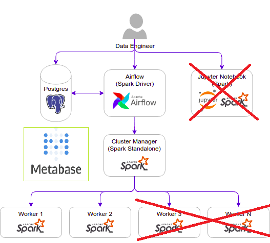
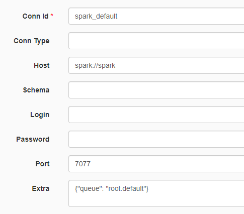
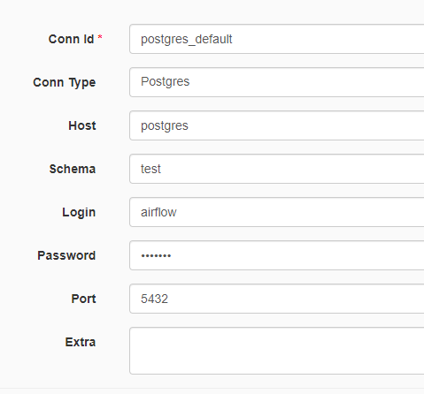
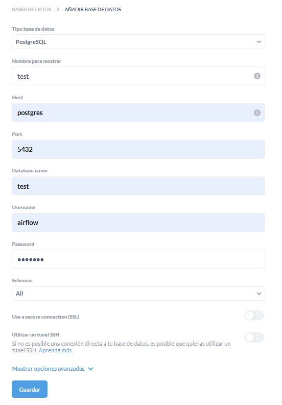
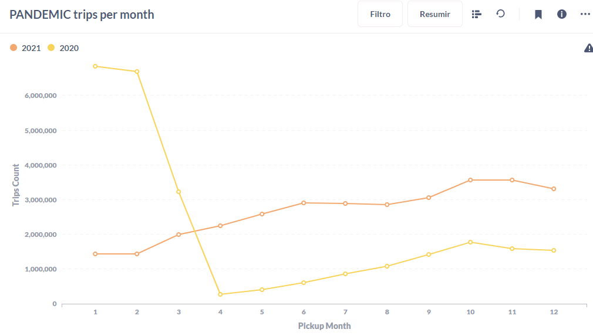

# Airflow Spark

The idea behind this project was to integrate my aquired knowledge in Airflow, Postgres, pySpark, Metabase and Docker into a single end to end simple project

For the architecture behind this I cloned [Cordon Thiago's Github repo](https://github.com/cordon-thiago/airflow-spark), but modified it towards my goal

    - removed jupyter container
    - working with just 2 Spark worker nodes
    - added Metabase container
    - added shared volume for spark-warehouse

## Architecture components

## Data Pipeline

    1. Downloads taxis data from NYC official repository (download DAG)
    2. Consolidates parquet files into a pySpark temp view
    3. Writes results of simple queries to the view into PG tables
    4. Metabase dashboard from the PG agg tables 

## Steps to run this project locally

### Build airflow-spark driver image
___

Inside the taxis-project/docker/docker-airflow

    $ docker build --rm --force-rm -t docker-airflow-spark:1.10.7_3.1.2 .

### Start containers
___

Navigate to airflow-spark/docker and:

    $ docker-compose up -d

Note: when running the docker-compose for the first time, the images `postgres:9.6`, `bitnami/spark:3.1.2` and `metabase/metabase` will be downloaded before the containers started.

### Check if you can access
___

Airflow: http://localhost:8282

Spark Master: http://localhost:8181

### Set spark-default and postgres-default connections
___

Before starting DAGs, the *spark-default* and *postgres-default* must be edited according to the compose yaml file

### Run Ariflow DAGs
___

Now that conns are set we can start both DAGs from the webserver UI

### Set spark-default and postgres-default connections
___

Go to Metabase: http://localhost:3001

Go to configuration at the top right corner to sync with the PG database

Once the DB is synced you can access the data in the avaible tables in gold schema to make vizualizations like this one

